# Overview

## Sign up with Microsoft 365 Essentials

1. Go to [Microsoft Teams Business Plans](https://www.microsoft.com/en-ca/microsoft-teams/compare-microsoft-teams-business-options?activetab=pivot:primaryr1)

2. Sign up on “Microsoft Teams Essentials” (try one month for free)

### Once you are signed-up, you will be able to sign into these sites:

- [Microsoft 365 admin center](https://admin.microsoft.com/#/homepage)

- [Azure Portal](https://portal.azure.com/#home)

- [Teams Developer Portal](https://dev.teams.microsoft.com/home)

## Creating the Azure Bot

1. Login to the [Azure Portal](https://portal.azure.com/#home)
2. Click on "Create a resource" to create a new Azure Bot.

    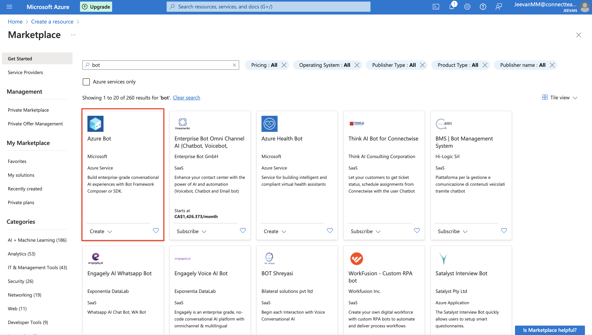

3. Click on "Azure Bot" to begin creating the bot.

    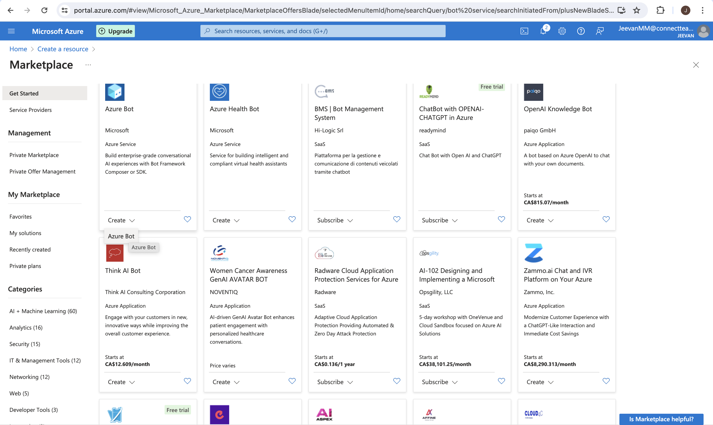

4. Give the bot a unique name for the Bot handle. This name needs to be globally unique. You can set a different display name later. Note: Try to keep the Bot Handle less than 20 characters. Choose a subscription if you have multiple subscriptions available. Click "Create new" to make a new resource group for the bot.

    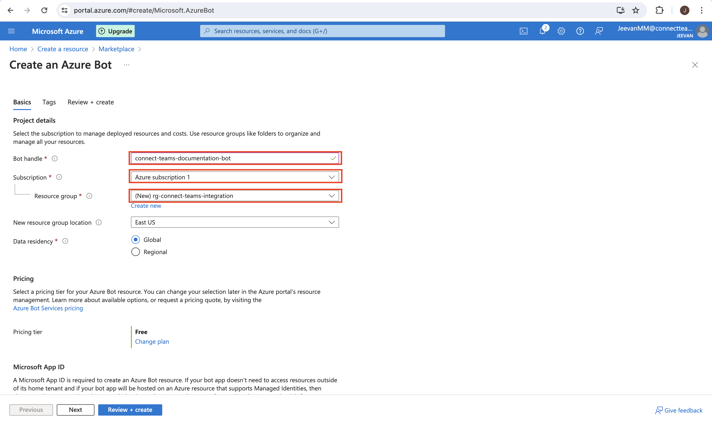

5. Give the resource group a unique name. It's best practice to start the resource group name with "rg-".

    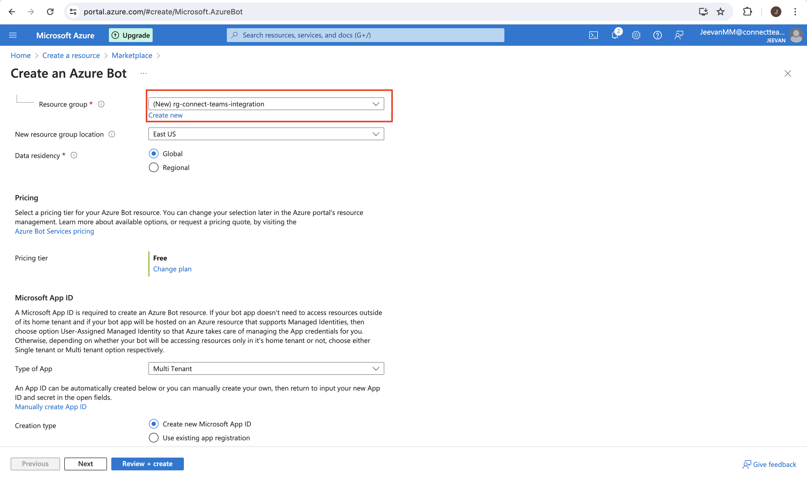

6. Select a location for the new resource group. For this example, "Canada Central" is used. Select "Single Tenant" as the App type. Choose "Create new Microsoft App ID" for the Creation type. Click "Review + Create".

    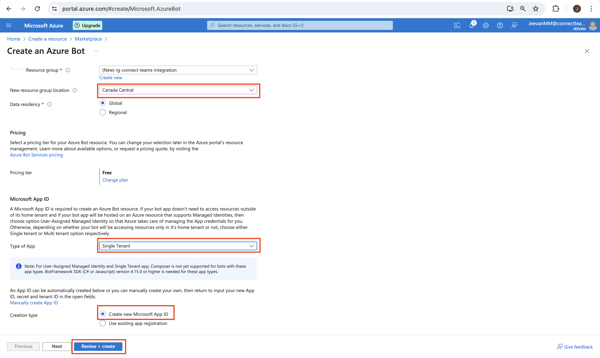

7. Click "Create" to deploy the Azure Bot.

    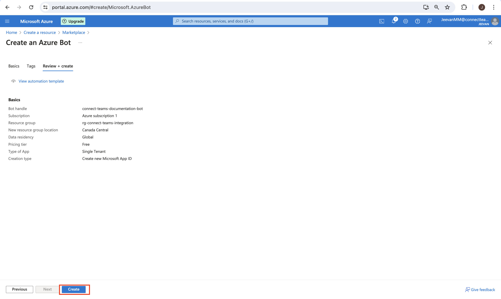

## Create a Microsoft Entra ID to act as the audience for the JWT generated by OAuth and configure the scope

1. This is required to set the Microsoft Entra ID as the audience for the JWT we create using SSO and define the scope in the JWT.

    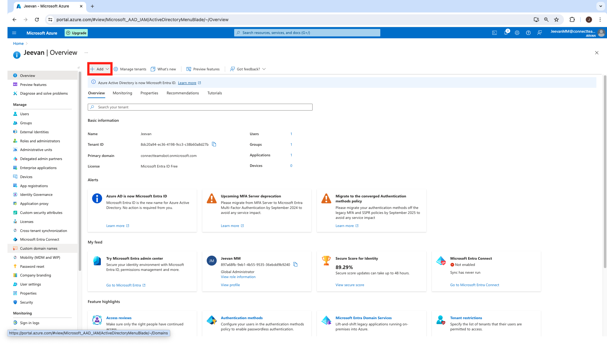

2. Go to "App registrations" and select "New registration". Enter a unique name and click "Register".

    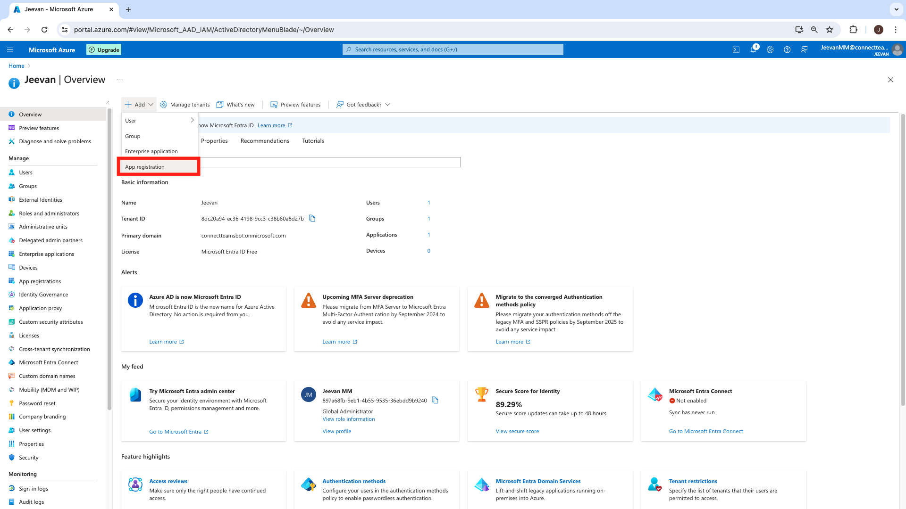

    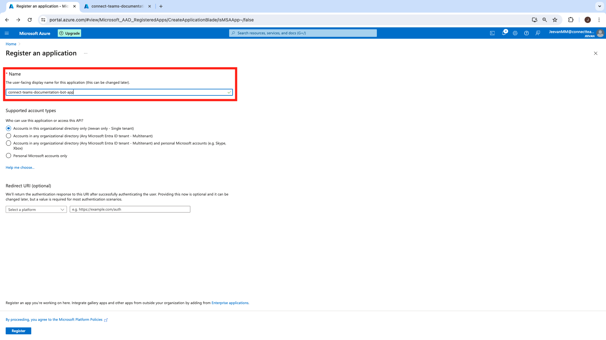

3. Navigate to "Expose an API", click "Add" next to Application ID URL. The Application ID URL will populate by default, then click "Save".

    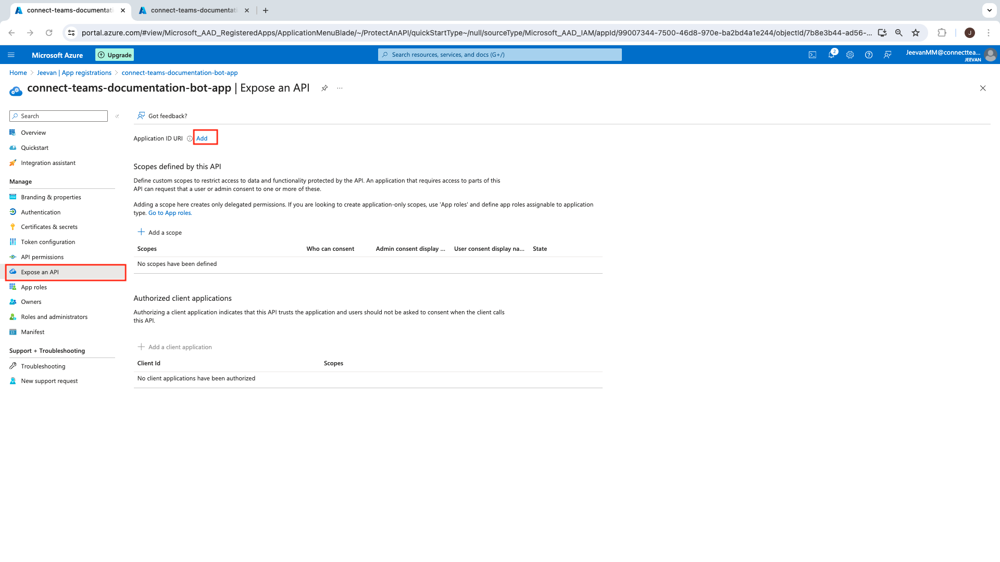

    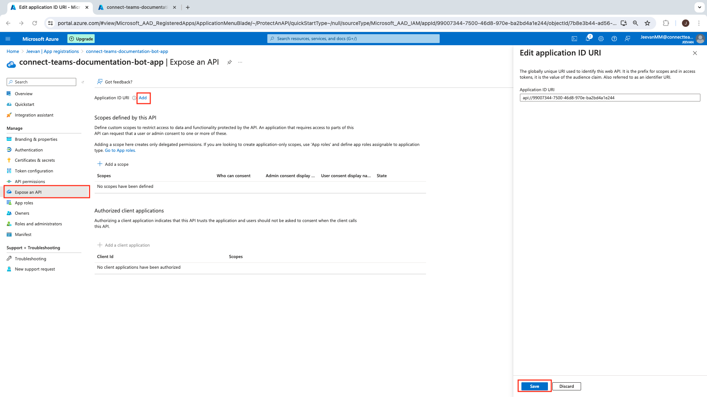

4. Click "Add a scope" to add the required scope for the JWT. Enter the scope name and details you want to display. The scope required is `GenAI.chatbot.proxy.read`. Select "Admins and users" for who can consent. Fill the required fields and save the configuration.

    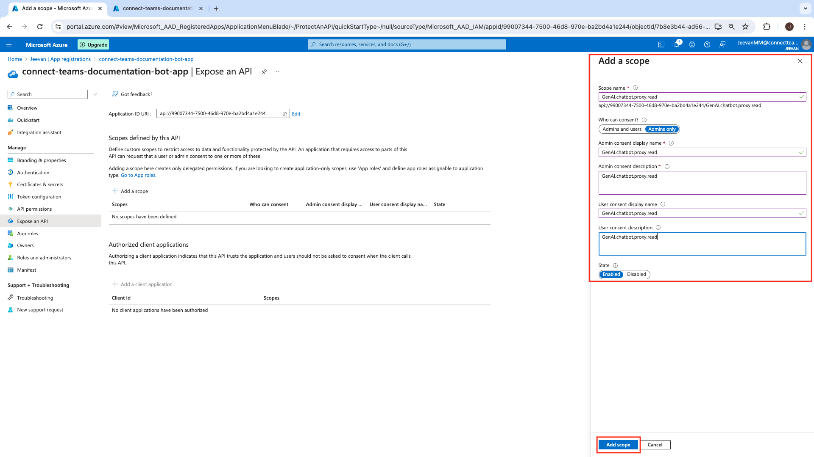

## Steps to Configure Azure Bot

1. Once the Bot is created, navigate to the bot, and open the bot.

    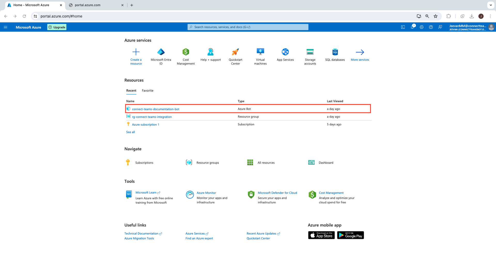

2. Navigate to “Channels” and add “Microsoft Teams” as a Channel from the Available Channels.

    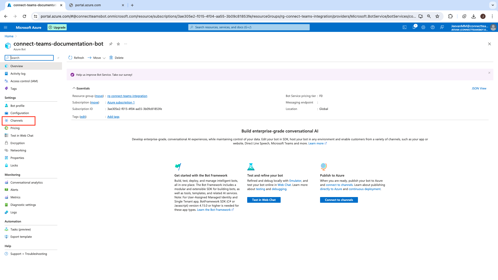

    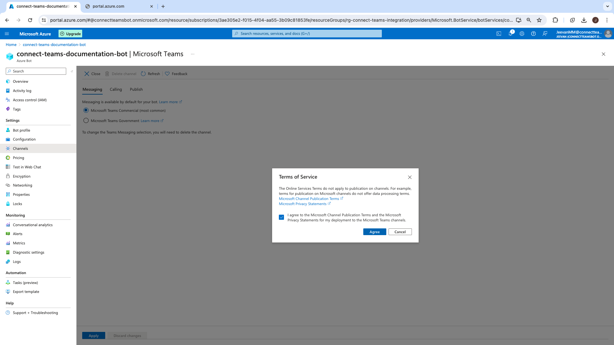

    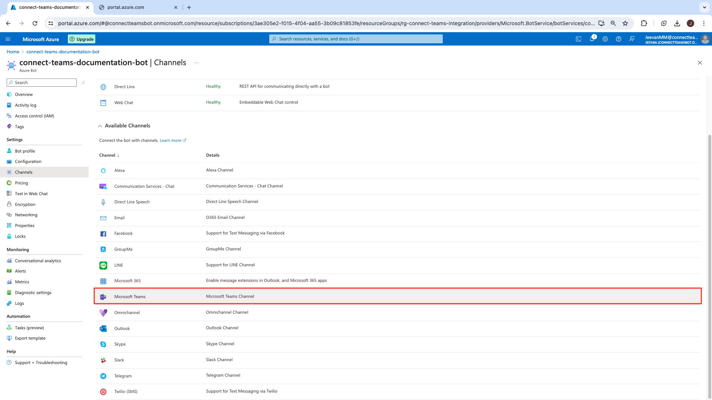

3. Navigate to Configuration.
Note: After we deploy our Node JS Messaging API resources using Terraform, we will enter our messaging endpoint here in the configuration. For now, leave this field empty.

    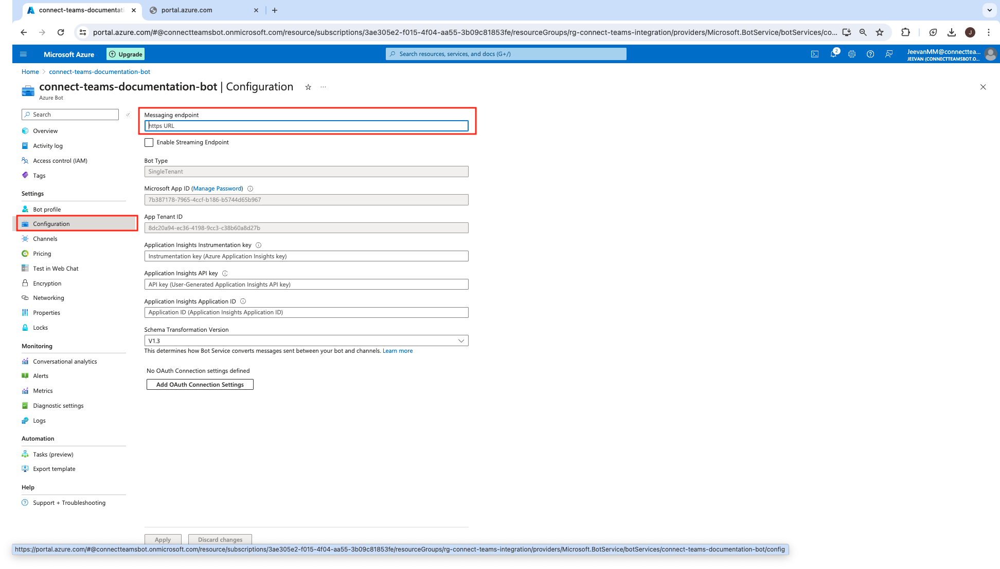

4. Now click on “Manage Password”, to manage Additional settings for the bot.

    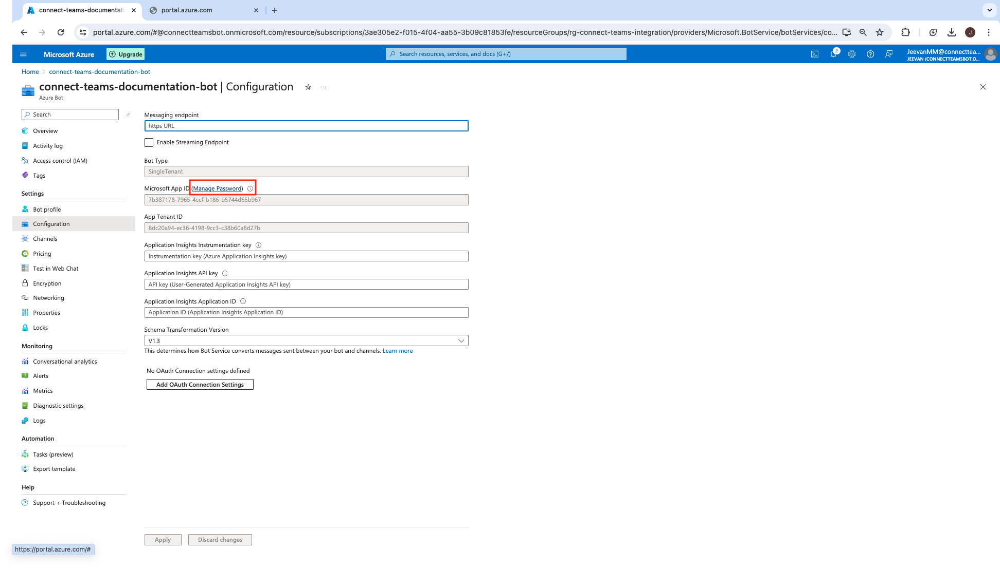

Note the following details from the deployed resources:

1. Teams app client ID
2. Teams app client secret
3. Teams app tenant ID

Next, proceed to [README.md](../README.md) for further steps. Once the Terraform resources have been deployed, revisit
the Azure bot and update the **Messaging endpoint** section to the Invoke URL of the API gateway. It would look something like this:

```plaintext
https://abcd1234.execute-api.us-east-1.amazonaws.com/dev/teams
```
