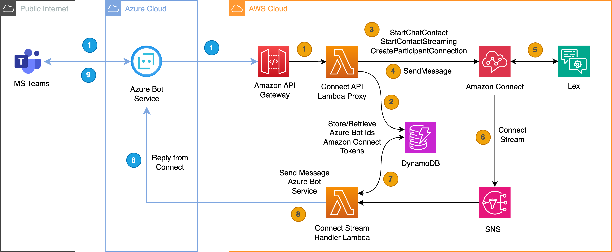
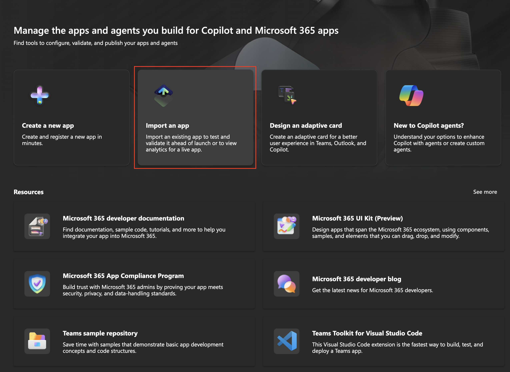
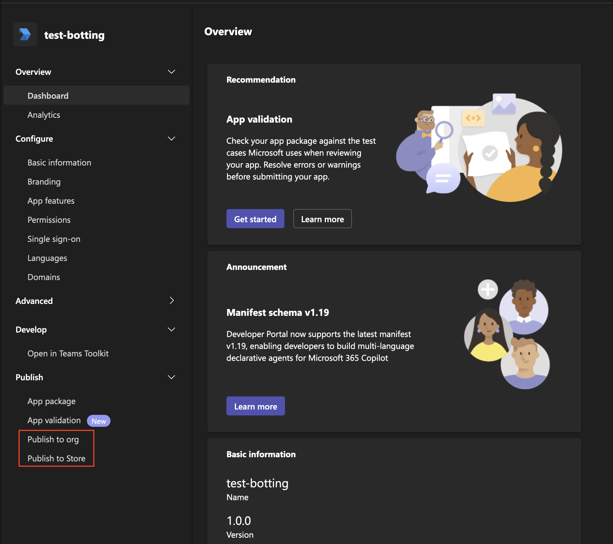
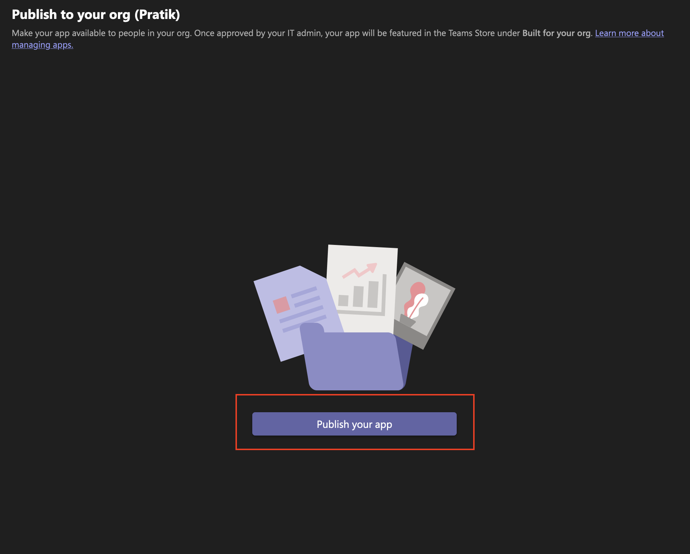
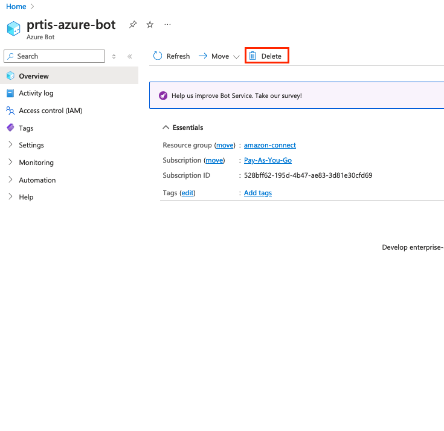
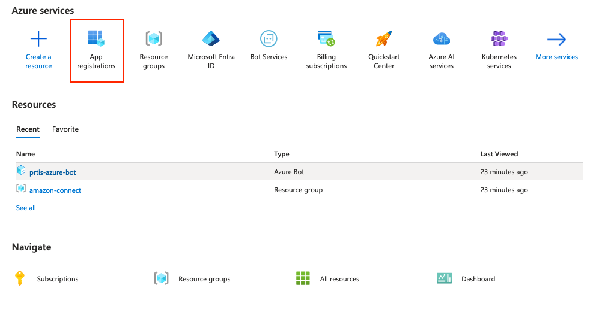
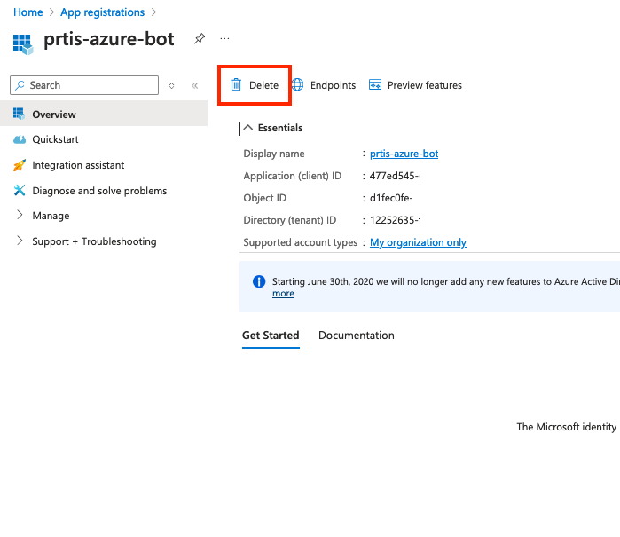

# Overview

This repository contains accompanying source code for the AWS Blog post, [Streamline employee support with Amazon Connect and Microsoft Teams integration](#)

This application allows Microsoft Teams to communicate with Amazon Connect via Azure Bot service. As a user, you must launch this application to start conversation with Amazon Connect.

When a user sends a message in Microsoft Teams application, the message is intercepted by Azure Bot service, which will invoke Amazon API Gateway API.  A Lambda function, ‘Connect Chat API’, starts a chat session with Amazon Connect and starts a CCP flow execution. This Lambda function stores the necessary Microsoft Teams user metadata and Amazon Connect metadata into Amazon DynamoDB table. The metadata is later used during the response flow.

The CCP flow, shown in ‘Amazon Connect integration detailed design’ section, contains Amazon Lex chat bot integration. Amazon Lex responds based on user’s input.  To keep things simple, for demonstration purposes, the solution discussed in this blog uses basic Amazon Lex utterances and canned responses.

Amazon Connect routes the response to SNS topic when a chat response is generated, either from the CCP flow directly or from a live agent during conversation. SNS subscription starts another Lambda function execution, ‘Connect Stream Lambda’. This Lambda function looks up user’s Microsoft Teams metadata in DynamoDB table using contact flow information sent in SNS payload.  The Lambda function finally sends Amazon Connect CCP flow response to the appropriate user in Microsoft Teams using Microsoft BotBuilder framework API.



The solution presented here implements a private chat with a Microsoft Teams app. You can extend the solution to interact with Microsoft Teams app that is part of a group conversation.

A reference implementation of Amazon API Gateway REST API, AWS Lambda Functions, Amazon Connect CCP Flow, Amazon Lex Chat bot, Amazon DynamoDB table, is provided here.

## Pre-requisites

### Microsoft Teams

You must have an active Microsoft Teams business plan activated. This allows for creation and publishing of Teams app which is used to demonstrate the solution.

### Azure resources

The solution requires setting up an Azure bot which integrates with Microsoft teams and acts as an interface between Microsoft Teams and Amazon API Gateway.

Lookup [pre-requisites](Prerequisites.md) to set these up.

## Deployment

### Deploying the resources on AWS

Terraform is used to deploy the components of the application. To perform the deployment, you must ensure that the pre-requisites are met
and then update a copy of the `sample.tfvars` file with the appropriate values.

Before deploying terraform resources, the `chat-clients-sdk` Lambda layer must be built first. This can simply be done
by running the shell script `chat-clients-sdk/build-layer.sh` which creates the build artifacts.

```bash
cd chat-clients-sdk
python -m build
sh build-layer.sh
```

Once this is completed, the layer and other resources can be deployed using the following commands.

```bash
terraform init
terraform apply -var-file=sample.tfvars
```

### Details from Azure

Some of the Microsoft Teams and Azure Bot related details that are needed for the deployed are mentioned below.

1. Teams app client ID - `teams_app_client_id`
2. Teams app client secret - `teams_app_client_secret`
3. Teams app tenant ID - `teams_tenant_id`
4. Flag indicating whether the app is single tenant - `teams_is_single_tenant_app`
5. User chat client type - `user_chat_client_type` which is set to `TEAMS` for this demonstration

Next, navigate to the [Amazon Lex Console](https://us-east-1.console.aws.amazon.com/lexv2/home) and navigate to the created bot - Bot version - All languages - English and click on `Build`.

### Publishing the bot to Microsoft Teams

Once the above steps are completed the bot can be added to Microsoft teams in the following manner:

1. Edit the [manifest.json](./azure-bot/teams_manifest/manifest.json) and update the following:

    ```plaintext
    id: A valid uuid

    developer.websiteUrl: The https:// URL to the developer's website. This link must take users to your company or product-specific landing page.

    developer.privacyUrl: The https:// URL to the developer's privacy policy.

    developer.termsOfUseUrl: The https:// URL to the developer's terms of use.

    bots.botId: Change this to the Azure Bot ID
    ```

2. You may refer to the [Manifest Schema guidelines](https://learn.microsoft.com/en-us/microsoftteams/platform/resources/schema/manifest-schema) for more details

3. Compress the `azure-bot/teams-manifest` into a zip.

4. Visit the [Tools Developer Portal](https://dev.teams.microsoft.com/tools) and select **Import an app**. Then upload the zip to create the app. 

5. Open the app settings and under **Publish** find **Publish to org** and click **Publish your app**.  

## Testing

Open the bot in Microsoft Teams to then have a conversation with the bot. You can request for a password reset or get the status of a ticket by saying phrases like: "Can you help me reset my password" or "What is the status of the ticket?" respectively. In this demonstration, some canned responses are returned. However, these can be enhanced in Amazon Lex to perform complex actions such as call a Lambda function to further process the request.

Additionally, you can also chat with a live agent by using phrases such as: "I want to speak with an agent" , "Can I talk to a human" etc. This will put you in a live queue which can be tested from Amazon Connect. You can find detailed steps [here](https://docs.aws.amazon.com/connect/latest/adminguide/chat-testing.html#test-chat).

## Clean-up

To delete the resources created on AWS use the following Terraform
command

```bash
terraform destroy -var-file=sample.tfvars
```

To delete the Azure resources - Azure bot and App registration, do the following:

1. On the Azure portal, open the Azure bot and under **Overview** click on **Delete**. 

2. To delete the App registration, open the registration. 

3. Find the app registration and click on **Delete** 
